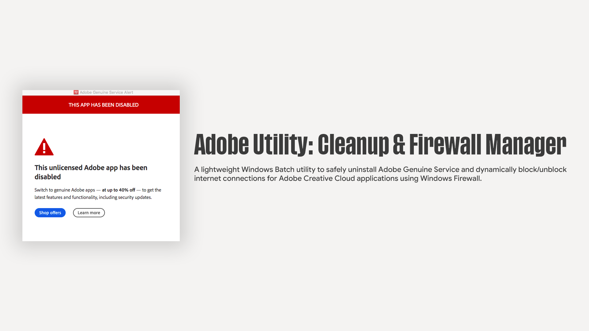

# Adobe Utility: Cleanup & Firewall Manager



A standalone Windows Batch script designed to remove the **Adobe Genuine Service (AGS)** and manage Windows Defender Firewall rules for Adobe applications. 

It dynamically scans your system directories to apply inbound and outbound firewall block rules, preventing background licensing checks while preserving core offline application features.

---

> ### ⚠️ Disclaimer & Important Notice
> **Use this script at your own risk.** Modifying firewall configurations and removing software services can alter how installed applications function.
> 
> **Impact on Online Features:**
> Applying firewall connection blocks will completely isolate your Adobe applications from the internet. As a result, **all network-dependent features will be disabled**, including:
> - Creative Cloud Cloud Sync & Storage
> - Adobe Stock & Typekit / Adobe Fonts
> - Neural Filters & Cloud-based Rendering
> - Firefly AI Generative Tools
> - Online License Verification & In-App Asset Store

---

## Features

- **Interactive Menu:** Run individual tasks or perform a full cleanup in one click.
- **Adobe Genuine Service Removal:** Stops background processes (`AGSService.exe`, `AdobeGCClient.exe`, `AdobeGenuineValidator.exe`) and uninstalls AGS via official cleanup utilities, `winget`, and `wmic`.
- **Dynamic Application Scanning:** Automatically searches `Program Files` and `Common Files` for installed Adobe `.exe` binaries—no hardcoded file paths needed.
- **Bi-Directional Blocking:** Creates both Inbound and Outbound block rules for every detected Adobe executable.
- **Complete Revert/Unblock Option:** Instantly scans and removes all script-generated firewall rules to restore default internet access.
- **Safety Checks:** Requires Administrator privileges and prompts for user confirmation before executing changes.

---

## Interactive Menu Overview

```text
========================================================
        ADOBE UTILITY: CLEANUP & FIREWALL MANAGER
========================================================

 [1] Uninstall Adobe Genuine Service ONLY
 [2] Apply Firewall Connection Blocks ONLY
 [3] Run BOTH (Uninstall AGS & Apply Firewall Blocks)
 [4] UNBLOCK / REVERT All Adobe Firewall Rules
 [5] Exit
========================================================
```
# Getting Started

## Prerequisites
* **OS:** Windows 10 or Windows 11
* **Privileges:** Administrator access (required to modify Firewall rules and Windows Services)

### Usage
1. Go to the **Releases** section on the right side of this repository page and download the latest `.bat` file (or `.zip` release).
2. Right-click `adobe_manager.bat` and select **Run as Administrator**.
3. Choose an option from the menu (`1–4`) and enter `Y` when prompted to confirm.

---

# Applications Covered by Firewall Rules

When selecting Option **2** or **3**, the script scans your system (`C:\Program Files\Adobe`, `C:\Program Files (x86)\Adobe`, and `Common Files`) to block inbound and outbound connections for all installed Adobe executables, including:

### Design, Photo & Digital Publishing
* Adobe Photoshop (All versions / CC 2017 – Present)
* Adobe Illustrator (All versions / CC 2017 – Present)
* Adobe InDesign (All versions / CC 2017 – Present)
* Adobe Lightroom & Lightroom Classic
* Adobe Photoshop Elements

### Video, Audio & Motion Graphics
* Adobe After Effects (All versions / CC 2017 – Present)
* Adobe Premiere Pro (All versions / CC 2017 – Present)
* Adobe Premiere Elements
* Adobe Media Encoder
* Adobe Audition
* Adobe Character Animator

### Web, 3D, Animation & Documents
* Adobe Acrobat Pro / Standard / Reader / DC
* Adobe Animate
* Adobe Dreamweaver
* Adobe Substance 3D Collection (Painter, Designer, Stager, Sampler)

### Core Services & Background Processes
* Adobe Creative Cloud Desktop Application
* Adobe Content Synchronizer / CoreSync
* Adobe Genuine Service & GC Client Utilities

---

# How to Verify Firewall Rules

1. Press `Win + R`, type `wf.msc`, and press **Enter** to open *Windows Defender Firewall with Advanced Security*.
2. Click **Inbound Rules** or **Outbound Rules** in the left sidebar.
3. Look for rules starting with `Block Adobe -` to confirm active entries.

---

# Unblocking / Reverting

If you ever need to restore internet functionality to your Adobe apps:

1. Launch the script as **Administrator**.
2. Select Option **`[4] UNBLOCK / REVERT All Adobe Firewall Rules`**.
3. Confirm the action to automatically remove all generated firewall rules.

---
